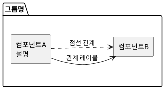
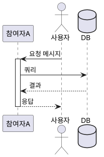
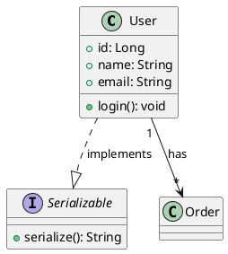
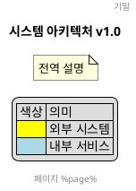
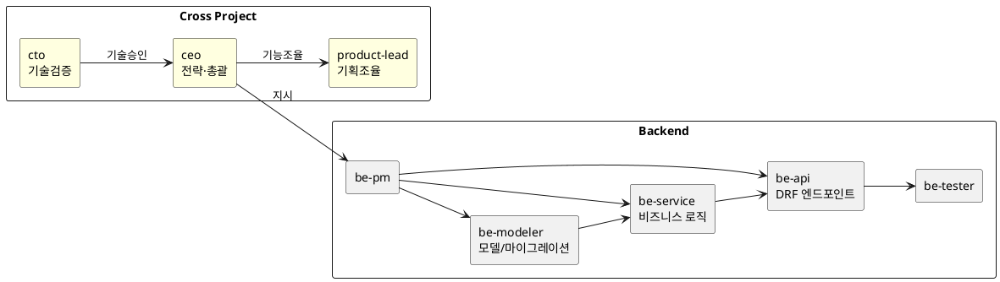

# PlantUML 다이어그램 작성

> 출처: https://plantuml.com (공식 문서 기반)

## 기본 구조

모든 PlantUML 파일은 `@startuml` / `@enduml` 블록으로 감싼다.

```puml
@startuml
title 다이어그램 제목
' 이것은 주석입니다
' 내용 작성
@enduml
```



## 다이어그램 유형 선택 기준

| 목적 | 유형 | 키워드 |
|------|------|--------|
| 시스템 구성 요소/아키텍처 | Component | `component`, `[이름]` |
| 호출 흐름/시간 순서 | Sequence | `->`, `-->` |
| 클래스/도메인 모델 | Class | `class`, `interface` |
| 상태 전이 | State | `state`, `-->` |
| 배포/인프라 | Deployment | `node`, `artifact` |
| 마인드맵 | MindMap | `*`, `**` |
| 작업 분류 | WBS | `*`, `**` |

---

## 1. Component Diagram (컴포넌트)

Agent 구조, 시스템 아키텍처 시각화에 사용.



### 주요 문법
- `[이름]` 또는 `component "이름" as 별칭` 으로 컴포넌트 선언
- `package`, `node`, `folder`, `cloud`, `database` 로 그룹화
- `-->` 실선 화살표, `..>` 점선 화살표
- `-left->`, `-right->`, `-up->`, `-down->` 방향 지정
- `[컴포넌트] #Yellow` 개별 색상 지정
- `hide @unlinked` 연결되지 않은 컴포넌트 숨기기

---

## 2. Sequence Diagram (시퀀스)

API 호출 흐름, Agent 간 메시지 흐름 표현에 사용.



### 주요 문법
- 참여자 유형: `participant`, `actor`, `boundary`, `control`, `entity`, `database`, `collections`, `queue`
- `->` 실선, `-->` 점선(응답), `->>` 얇은 화살표
- `activate` / `deactivate` 생명선 활성화
- `note left:`, `note right:`, `note over A, B:` 메모
- `== 구분선 제목 ==` 단계 구분
- `autonumber` 자동 번호 부여
- `alt/else/end`, `loop`, `opt`, `par` 조건/반복 그룹

---

## 3. Class Diagram (클래스)

도메인 모델, ERD 유사 구조 표현.



### 관계 표기
| 표기 | 의미 |
|------|------|
| `<|--` | 상속(extends) |
| `..|>` | 구현(implements) |
| `-->` | 연관(association) |
| `*-->` | 합성(composition) |
| `o-->` | 집합(aggregation) |
| `..>` | 의존(dependency) |

---

## 4. 스타일링 (skinparam)

```puml
@startuml
skinparam packageStyle rectangle
skinparam componentStyle rectangle
skinparam backgroundColor #FAFAFA

skinparam component {
  BackgroundColor #E8F4FD
  BorderColor #2196F3
  FontSize 12
}

skinparam arrow {
  Color #555555
  FontSize 10
}
@enduml
```

### 자주 쓰는 skinparam
| 파라미터 | 용도 |
|----------|------|
| `left to right direction` | 좌→우 방향 레이아웃 |
| `skinparam componentStyle rectangle` | UML 아이콘 제거, 사각형만 표시 |
| `skinparam packageStyle rectangle` | 패키지 테두리 스타일 |
| `skinparam BackgroundColor transparent` | 배경 투명 |
| `skinparam monochrome true` | 흑백 모드 |
| `skinparam handwritten true` | 손글씨 스타일 |

---

## 5. 공통 요소



---

## 6. Agent UML 작성 패턴 (프로젝트 적용)

이 프로젝트의 Agent 구조를 표현할 때 사용하는 패턴:



---

## 렌더링 방법

```bash
# Java로 직접 렌더링 (plantuml.jar 필요)
java -jar plantuml.jar diagram.puml

# PNG 출력
java -jar plantuml.jar -tpng diagram.puml

# SVG 출력
java -jar plantuml.jar -tsvg diagram.puml

# 온라인 렌더러 사용
# https://www.plantuml.com/plantuml/uml/
```

## 체크리스트

- [ ] `@startuml` / `@enduml` 블록 확인
- [ ] `title` 제목 추가
- [ ] 다이어그램 유형에 맞는 키워드 사용
- [ ] `as 별칭` 으로 공백·특수문자 있는 이름 처리
- [ ] 방향 설정: `left to right direction` 또는 기본(top-down)
- [ ] `skinparam componentStyle rectangle` 적용 (깔끔한 박스)
- [ ] 관계선 레이블로 흐름 의미 명시
- [ ] 그룹(`package`/`node`) 으로 논리 단위 구분
